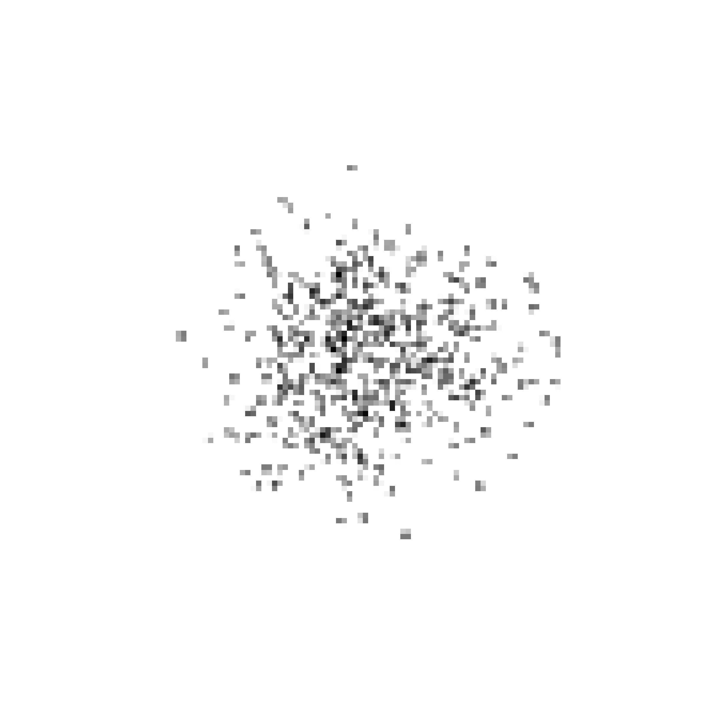

#### My implementation of a very interesting paper: [Complex Networks Classification with Convolutional Neural Network](https://arxiv.org/pdf/1802.00539.pdf)

***

**Custom pipeline to convert graphs into images**


|   **Intput BA network** | **After pipeline** |
|:-:	|:-:	|
| |  |


**Task complex network classification: BA vs WS**

```
accuracy: 0.8211 - AUC: 0.9094
```

**Model architecture**


