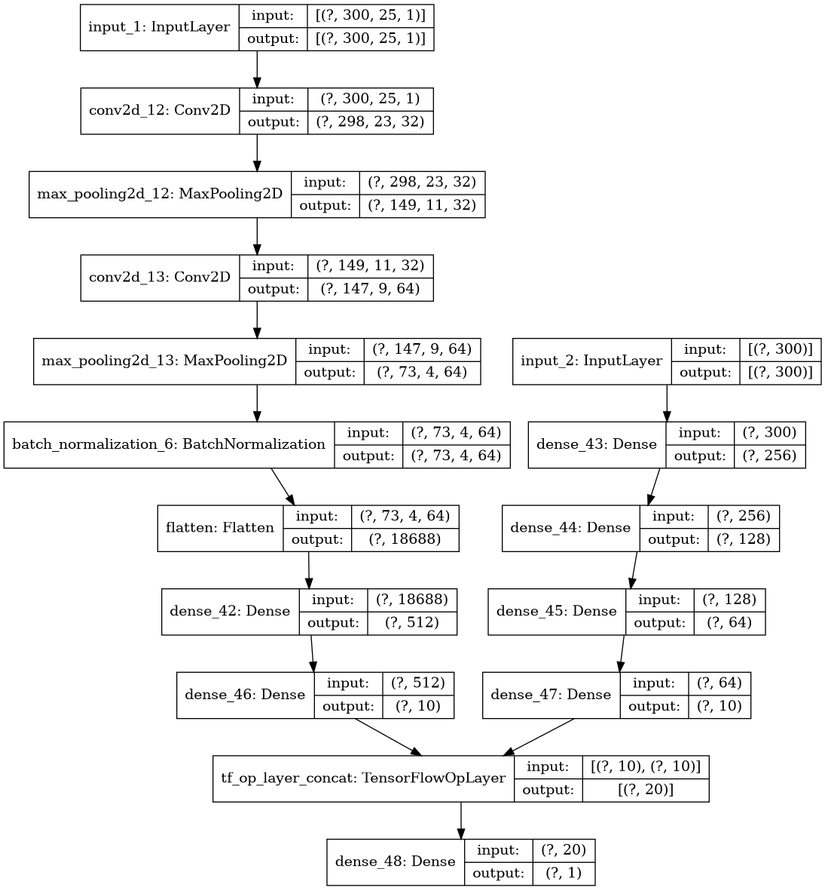

## CNNs for sentiment classification (both word and character level)

#### Based on:
- [Convolutional Neural Networks for Sentence Classification](https://arxiv.org/abs/1408.5882)
- [Character-level Convolutional Networks for Text Classification](https://arxiv.org/abs/1509.01626)

|   	|
|:-:	|
|   **Combination of CNN and dense model for sentiment classification**	|

Movie dataset from: http://www.cs.cornell.edu/people/pabo/movie-review-data/
