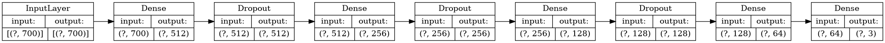
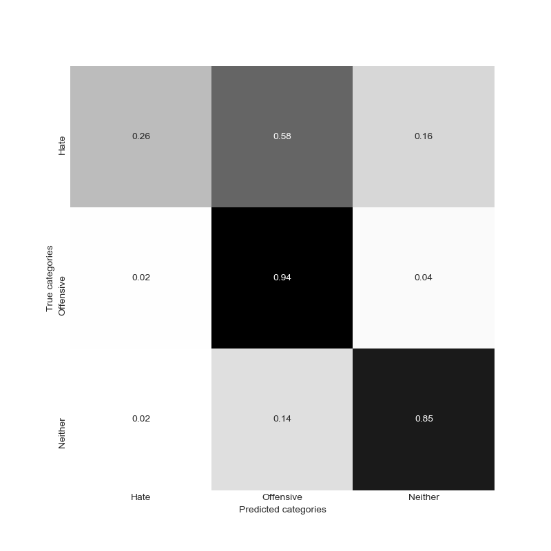

## Detecting Hate Speech in Social Media 

Based on:
> Harvard Medical School, Boston, MA, United States, et al. “Detecting Hate Speech in Social Media.” RANLP 2017 - Recent Advances in Natural Language Processing Meet Deep Learning, Incoma Ltd. Shoumen, Bulgaria, 2017, pp. 467–72. DOI.org (Crossref), doi:10.26615/978-954-452-049-6_062.

Data from: https://github.com/t-davidson/hate-speech-and-offensive-language

**Deep learning approach using [sent2vec](https://github.com/epfml/sent2vec)**

Results:

                precision    recall  f1-score   support

           0       0.49      0.20      0.29       295
           1       0.93      0.95      0.94      3814
           2       0.81      0.90      0.85       848

    accuracy                           0.89      4957
    macro avg      0.74      0.68      0.69      4957
    weighted avg   0.88      0.89      0.88      4957

**With RandomForestClassifier**

Results:

              precision    recall  f1-score   support

           0       0.45      0.26      0.33       290
           1       0.93      0.94      0.94      3832
           2       0.79      0.85      0.82       835

    accuracy                           0.89      4957
    macro avg      0.72      0.68      0.70      4957
    weighted avg   0.88      0.89      0.88      4957

