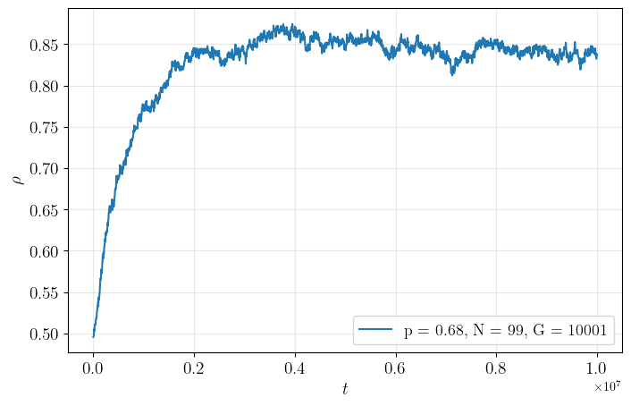

## Homophily based on few attributes can impede structural balance

The project aims to reproduce paper by P.Górski _et.al_ [1] and extends model by:

- using not only boolean attributes as the state of each agent
- exploring the different update rule

[1] Górski, Piotr & Bochenina, Klavdiya & Hołyst, Janusz & D'Souza, Raissa. (2020). _Homophily based on few attributes can impede structural balance_. 

