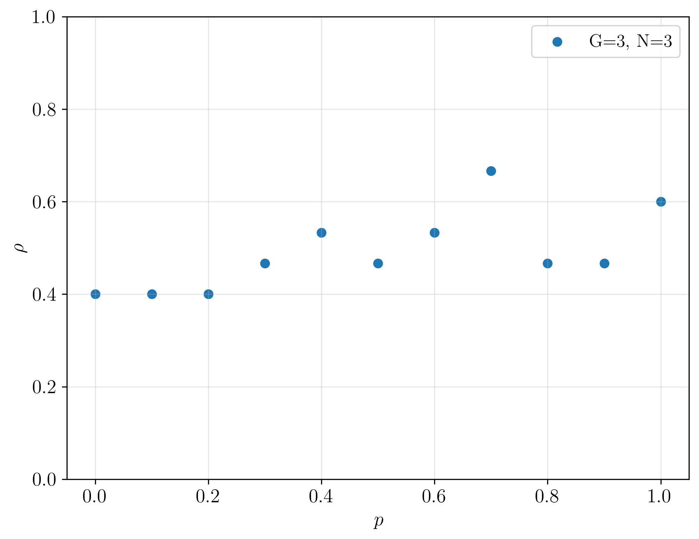
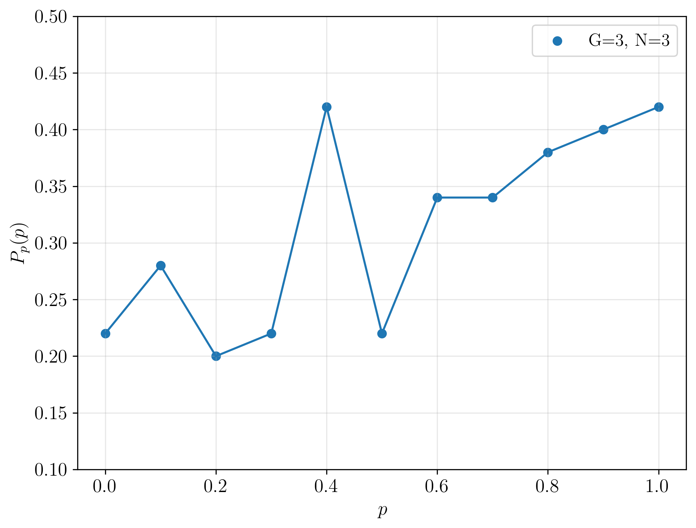

## Homophily based on few attributes can impede structural balance

The project aims to reproduce paper by P.Górski _et.al_ [1] and extends model by:

- using not only boolean attributes as the state of each agent
- exploring the different update rule

[1] Górski, Piotr & Bochenina, Klavdiya & Hołyst, Janusz & D'Souza, Raissa. (2020). _Homophily based on few attributes can impede structural balance_. 

### Results

a) How the positive links density changes in time? Here is an example for network of 99 agents, each one has 10001 attributes. Simulation was performed for 2x10^7 steps.
It agrees with Fig.2 from [1].

b) phase diagram: positive density links vs `p`. Unfortunately the obtained result does not match Fig.2 [1]. One reason may be the insufficient number of simulation steps or a little bug in my program.

c) phase diagram: paradise probability vs `p`. Also here the results are quite different from Fig 4. in [1].

